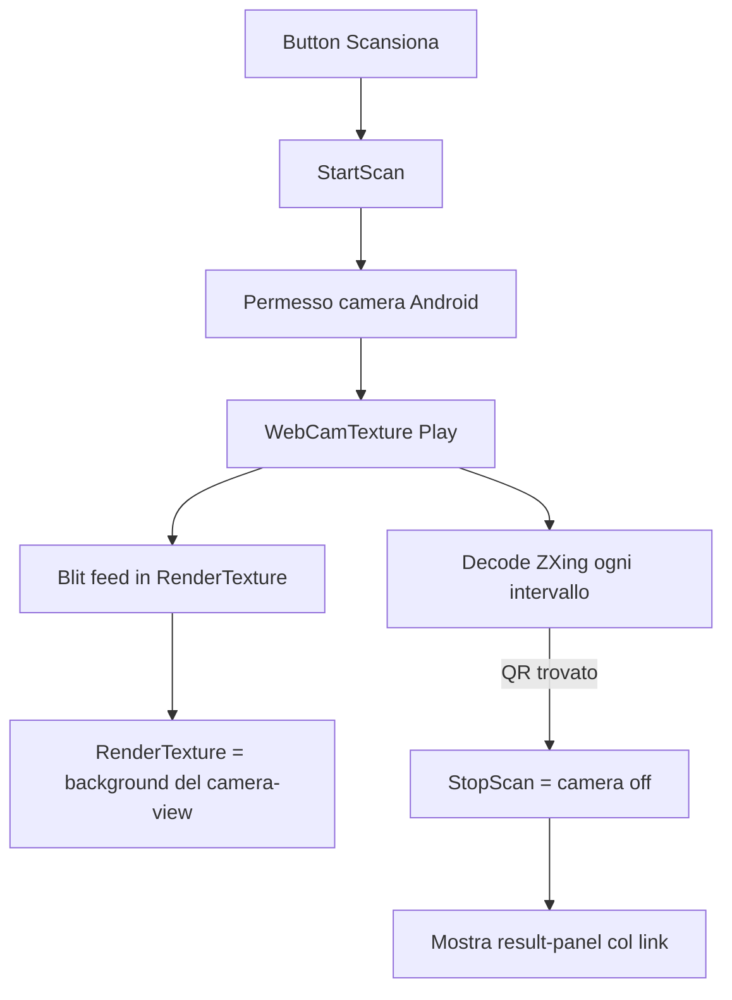

# Feature: QR Scanner (camera + lettura QR del museo)

Apre la camera del telefono, mostra il feed a schermo intero con un mirino
("Inquadra il QR"); quando legge un QR **chiude la camera e mostra il link** letto.

I QR sono quelli **già presenti sui pannelli del MUSE**: inquadrandoli il gioco
ottiene un link/identificatore dell'exhibit.

## Pezzi

| File | Ruolo |
|---|---|
| `QrScannerController.cs` | Logica: permesso camera, feed, decodifica ZXing, result panel |
| `Assets/UI Toolkit/QrScanner.uxml` | Struttura UI (camera-view, overlay+mirino, result panel) |
| `Assets/UI Toolkit/QrScanner.uss` | Stile (mirino, testo, pannelli) |

## Come funziona (architettura)

- **Camera**: `WebCamTexture` (niente AR/ARCore — per leggere un QR basta il video).
- **Feed in UI Toolkit**: `StyleBackground` non accetta un `WebCamTexture`, quindi
  ogni frame lo copiamo in una `RenderTexture` (`Graphics.Blit`) e quella la
  mettiamo come `background-image` del `#camera-view`. Il Blit corregge anche il
  mirror verticale del feed mobile.
- **Decodifica**: ZXing, solo formato `QR_CODE`, ogni `decodeInterval` secondi
  (non ogni frame: pesa e scalda il telefono).
- **Risultato**: a QR letto → `StopScan()` + `#result-panel` visibile col link
  in `#result-label`. Evento `OnQrDecoded(string)` per reagire al contenuto.

## Dipendenza: ZXing ✅ (già presente)

`Assets/Plugins/zxing.unity.dll` — **ZXing.Net 0.16.11**, build `unity/` (espone
`BarcodeReader.Decode(Color32[], w, h)`, usato dal controller). Tracciata in LFS
via `.gitattributes` (`*.dll filter=lfs`).

> Codice verificato contro l'API di questa DLL: `BarcodeReader` (classe concreta,
> non `IBarcodeReader`, perché `AutoRotate` sta su `BarcodeReaderGeneric`),
> `DecodingOptions.TryHarder/PossibleFormats`, `BarcodeFormat.QR_CODE`.

## Setup in editor (UI Toolkit)

1. **GameObject "QrScanner"** in scena → aggiungi componente **UIDocument**:
   - *Panel Settings*: un asset PanelSettings (creane uno se non c'è).
   - *Source Asset*: `Assets/UI Toolkit/QrScanner.uxml`.
2. Sullo stesso GameObject aggiungi il componente **QrScannerController**.
3. (Lo USS è già linkato dall'UXML via `<Style src="QrScanner.uss" />`.)

Gli elementi UXML hanno i `name` che il controller cerca: `scan-button`,
`camera-view`, `overlay`, `close-button`, `result-panel`, `result-label`,
`rescan-button`. Se rinomini in UXML, aggiorna le query in `OnEnable()`.

## Test SENZA telefono

Funziona in editor con la **webcam del PC**: Play → "Scansiona" → consenti webcam →
inquadri un QR (anche da monitor) → appare il link. Comodo per iterare in jam
prima di buildare l'APK.

## Permessi Android

Il permesso camera è gestito a runtime nel codice. In Build verifica che
`Project Settings → Player → Android` includa il permesso camera (Unity lo aggiunge
in automatico rilevando `WebCamTexture`; se non builda, aggiungi
`android.permission.CAMERA` al manifest).

## Stato / step

- ✅ **Step 1**: camera + overlay mirino + testo "Inquadra il QR".
- ✅ **Step 2**: decodifica ZXing → chiude camera → mostra il link.
- ⏭️ **Possibili next**: bottone "Apri" (`Application.OpenURL`), reagire al
  contenuto del QR (caricare l'exhibit corrispondente nel gioco).
